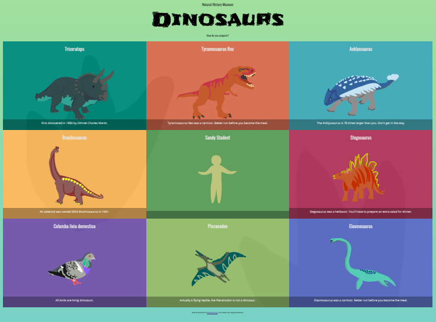

# Dinosaur Inforgraphic

**Reference URL**: [Project Tutorial](https://learn.udacity.com/nanodegrees/nd032/parts/cd0704 "Object-Oriented Javascript: Dinosaurs Infographic Project")

## Project Image

## Project Description

Building an infographic derived from provided data, and user-submitted data. Pulling in information from a form and using it to complete an array of objects that will be appended to the DOM.

The functionality for this project serves two purposes:

- Improve experience building objects with JavaScript
- Taking advantage of user interaction with the DOM

## How to run

1. Open project folder
2. In the terminal, run 'node server.js'
3. Open a web browser to url: http://localhost:8000/
